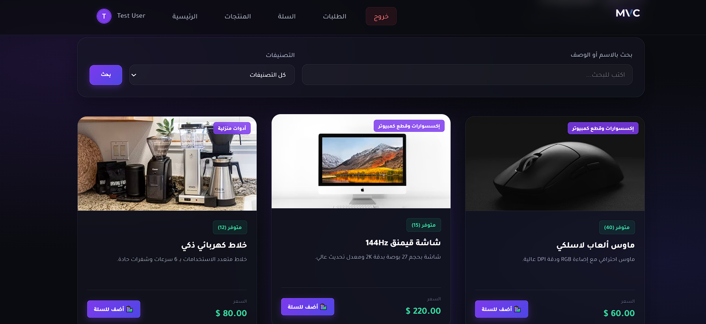
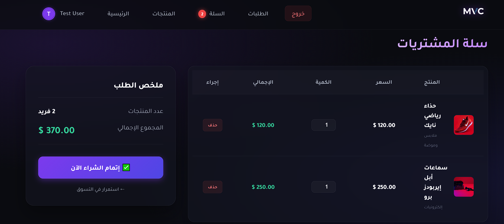
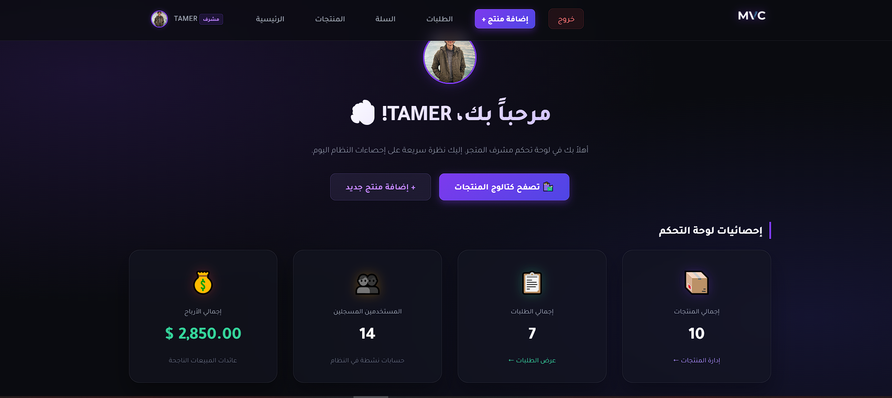

# 🛒 MVC E-Commerce Platform

متجر إلكتروني متكامل مبني من الصفر باستخدام نمط معمارية **MVC (Model-View-Controller)** باستخدام لغة PHP (بدون استخدام إطارات عمل جاهزة). يهدف المشروع لتوفير تجربة تسوق سلسة مع لوحة تحكم لإدارة المنتجات، ونظام سلة مشتريات، وطلبات.

## ✨ المميزات (Features)

*   **بنية MVC نظيفة:** فصل كامل بين الـ Logic (النماذج)، وواجهة المستخدم (العروض)، والمتحكمات (Controllers)، مما يجعل الكود سهل القراءة والتطوير.
*   **نظام التوجيه (Routing):** نظام توجيه مخصص (Custom Router) للتعامل مع الروابط بشكل أنيق وودي للـ SEO (مثل: `/product/show/1`).
*   **نظام مصادقة متكامل (Authentication):** تسجيل دخول، تسجيل حساب جديد، وإدارة جلسات المستخدم (Sessions) مع صلاحيات (Admin / Customer).
*   **إدارة المنتجات (للمشرفين فقط):** يمكن للمسؤول (Admin) إضافة، تعديل، وحذف المنتجات ورفع الصور.
*   **تصفح وتصفية المنتجات:** واجهة جذابة لعرض المنتجات مع إمكانية البحث بالاسم أو الوصف، والتصفية حسب التصنيفات.
*   **سلة المشتريات (Cart):** يمكن للعميل إضافة المنتجات، تعديل الكميات، وإتمام الطلب (Checkout) مع التحقق من توفر المخزون تلقائياً.
*   **نظام الطلبات (Orders):** تسجيل الطلبات وخصم الكمية المشتراة من المخزون بشكل تفاعلي.
*   **تصميم عصري (UI/UX):** واجهة مستخدم حديثة بأسلوب زجاجي (Glassmorphism) متوافقة مع جميع الشاشات.

## 🛠️ التقنيات المستخدمة (Tech Stack)

*   **الواجهة الخلفية (Backend):** PHP (OOP & MVC)
*   **قاعدة البيانات (Database):** MySQL (PDO)
*   **الواجهة الأمامية (Frontend):** HTML5, CSS3 (Vanilla), JavaScript
*   **الهيكلة:** Model-View-Controller Architecture

## 🚀 طريقة التشغيل محلياً (Installation)

1.  قم باستنساخ المستودع (Clone the repository).
2.  انقل مجلد المشروع إلى مجلد `htdocs` الخاص بـ XAMPP (أو ما يعادله).
3.  قم بإنشاء قاعدة بيانات جديدة في MySQL.
4.  تأكد من تحديث بيانات الاتصال بقاعدة البيانات في ملف `app/config/config.php`:
    ```php
    define('DB_HOST', 'localhost');
    define('DB_USER', 'root');
    define('DB_PASS', '');
    define('DB_NAME', 'your_database_name');
    define('URLROOT', 'http://localhost/mvc/public');
    ```
5.  شغّل مشروعك من المتصفح عبر الدخول إلى الرابط: `http://localhost/mvc/public`.
*(ملاحظة: قاعدة البيانات سيتم إنشاؤها وتكوين جداولها تلقائياً عند أول تشغيل للمشروع הודות لآلية الـ Auto-migration في كود الـ Database).*

## 📸 لقطات الشاشة (Screenshots)

*(قم بوضع صور مشروعك في مجلد `screenshots` وضع مسارها هنا)*

### 1. الصفحة الرئيسية والمنتجات


### 2. سلة المشتريات


### 3. لوحة تحكم المشرف (إضافة منتج)


---
*تم التطوير بكل ❤️ باستخدام PHP MVC.*
